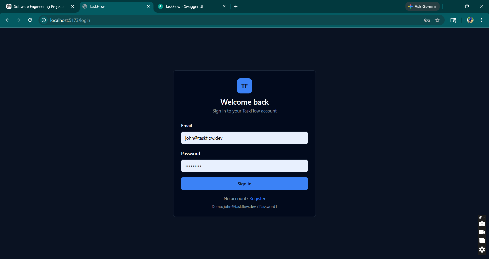
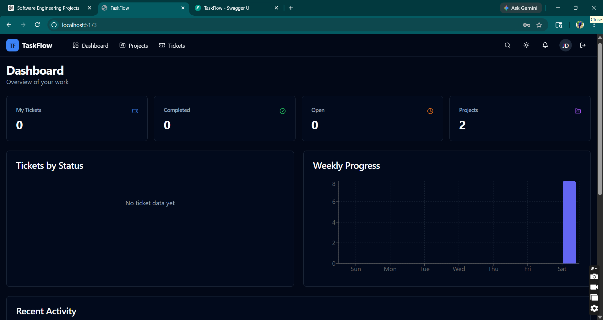
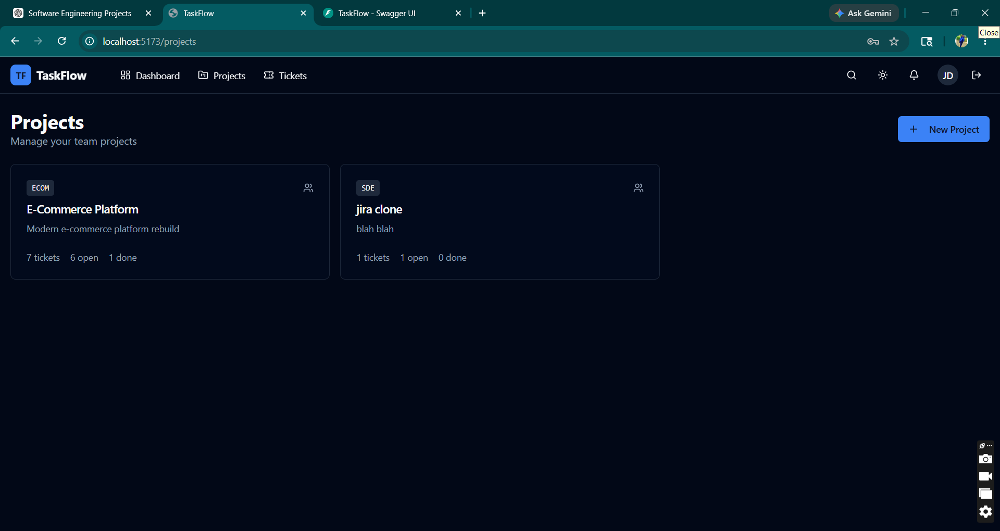
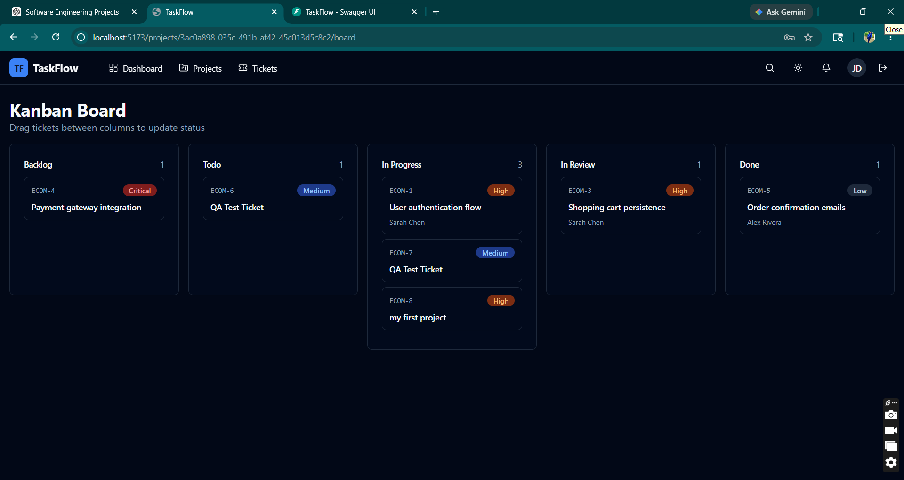
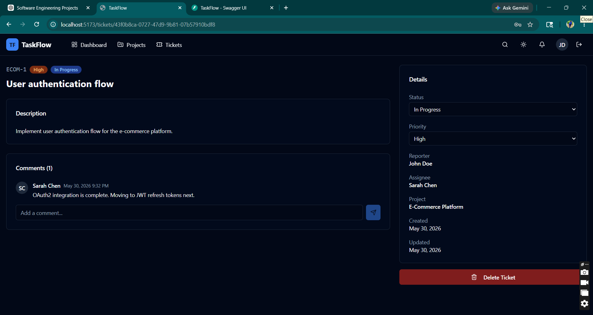

This README is written to look professional to recruiters and hiring managers. Replace the screenshot paths once you add screenshots.

# 🚀 TaskFlow - Full Stack Project Management Platform

TaskFlow is a modern Jira-inspired project management platform built with React, FastAPI, PostgreSQL, and Docker.

The application enables teams to manage projects, track tickets, collaborate through comments, monitor progress using Kanban workflows, and gain insights through analytics dashboards.

This project was built to learn and demonstrate full-stack software engineering concepts including API design, authentication, database modeling, Dockerized deployment, frontend architecture, and system design.

---

## ✨ Features

### Authentication & Security

- User Registration
- User Login
- JWT Authentication
- Refresh Token Support
- Password Hashing
- Protected Routes

### Project Management

- Create Projects
- Update Projects
- Delete Projects
- Project Dashboard
- Team Member Management APIs

### Ticket Management

- Create Tickets
- Update Tickets
- Delete Tickets
- Assign Tickets
- Priority Management
- Status Tracking
- Search and Filtering
- Pagination

### Kanban Board

- Drag-and-Drop Workflow
- Backlog
- Todo
- In Progress
- In Review
- Done

### Collaboration

- Ticket Comments
- Activity Tracking
- Notifications

### Analytics Dashboard

- Ticket Status Distribution
- Weekly Progress Tracking
- Project Statistics

### DevOps

- Dockerized Deployment
- Multi-Container Architecture
- Health Checks
- Seed Data Support
- Environment Configuration

---

## 🏗️ Architecture

Frontend (React + TypeScript)  
↓  
FastAPI Backend  
↓  
Service Layer  
↓  
Repository Layer  
↓  
PostgreSQL Database

The backend follows a layered architecture using Repository and Service patterns to improve maintainability and separation of concerns.

---

## 🛠️ Tech Stack

### Frontend

- React 19
- TypeScript
- Vite
- Tailwind CSS
- React Query
- React Router
- React Hook Form
- Zod
- Recharts
- DnD Kit

### Backend

- FastAPI
- SQLAlchemy
- Pydantic
- JWT Authentication
- Passlib

### Database

- PostgreSQL

### DevOps

- Docker
- Docker Compose
- Nginx

### Testing

- Pytest
- Automated API QA Scripts

---

## 📂 Project Structure

```text
JIRA-CLONE-
│
├── backend/
│   ├── app/
│   │   ├── api/
│   │   ├── models/
│   │   ├── repositories/
│   │   ├── schemas/
│   │   ├── services/
│   │   └── core/
│   │
│   ├── tests/
│   └── scripts/
│
├── frontend/
│   ├── src/
│   │   ├── components/
│   │   ├── pages/
│   │   ├── lib/
│   │   └── assets/
│
├── docker-compose.yml
├── README.md
└── QA_REPORT.md

```

---

##📸 Screenshots

### Login Page



### Dashboard



### Projects



### Kanban Board



### Ticket Details



## 🚀 Getting Started

### Prerequisites

- Docker Desktop
- Git

### Clone Repository

```bash
git clone https://github.com/meghaagarwaal/JIRA-CLONE-.git
cd JIRA-CLONE-

```

### Run Application

```bash
docker compose up --build

```

Or run in detached mode:

```bash
docker compose up -d

```

---

## 🌐 Application URLs

Frontend:

```text
http://localhost:5173

```

Backend:

```text
http://localhost:8000

```

API Documentation:

```text
http://localhost:8000/docs

```

---

## 🔑 Demo Credentials

```text
Email: john@taskflow.dev
Password: Password1

```

---

## 🧪 Testing

Run automated QA checks:

```bash
python scripts/qa_test.py

```

Run backend tests:

```bash
pytest

```

---

## 📈 What I Learned

Through this project I gained hands-on experience with:

- REST API Design
- JWT Authentication
- SQLAlchemy ORM
- PostgreSQL Database Modeling
- Repository Pattern
- Service Layer Architecture
- Docker & Docker Compose
- React Query
- Frontend State Management
- Kanban Workflow Systems
- Full-Stack Application Development
- Automated Testing and QA

---

## 🔮 Future Improvements

- Alembic Database Migrations
- Real-Time Updates using WebSockets
- Sprint Management
- File Attachments
- Email Notifications
- Team Analytics
- AI Sprint Planning Assistant
- CI/CD Pipeline with GitHub Actions

---

## 📄 License

This project was created for educational and portfolio purposes.

---

## 👩‍💻 Author

Megha Agarwal

GitHub:  
[https://github.com/meghaagarwaal](https://github.com/meghaagarwaal)

After adding this README, create a `screenshots/` folder and add 4–5 screenshots from your running application. That alone will make the repository look significantly more professional.